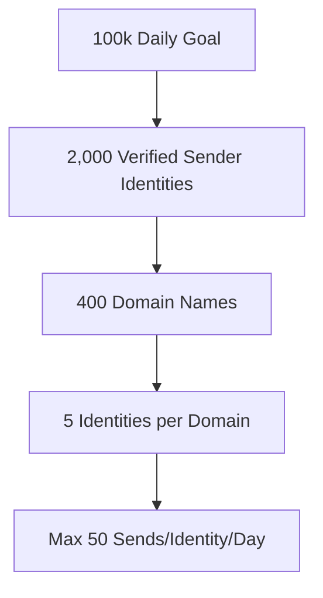

# Scaling to 100k+ Daily Outbound Sends Safely: Architecture & Moat

This document details how Sovereign Engine scales outbound capacity from hundreds of emails daily to an enterprise-grade **100k+/day throughput** while maintaining deliverability, protecting domain reputations, and bypassing ISP spam filters.

---

## 1. The Scaling Math & Capacity Planner

To send 100,000 emails per day without triggering ISP spam filters, we enforce a strict horizontal scale model: **many domains, many inbox identities, and low volume per identity**. 



### Capacity Model Formula
* **Goal**: 100,000 sends/day
* **Safety Threshold**: Max 50 sends per inbox identity per day.
* **Domain Allocation**: Max 5 inbox identities per domain name (to avoid domain-level reputation pooling issues).
* **Identities Needed**: `100,000 / 50 = 2,000` active inbox identities.
* **Domains Needed**: `2,000 / 5 = 400` distinct domain names.

This model is programmatically implemented in [sending-capacity-diagnostics.ts](file:///Users/vishnuvardhanburri/Code/sovereign-engine/code/apps/api-gateway/lib/sending-capacity-diagnostics.ts) within the [getSendingCapacityDiagnosis](file:///Users/vishnuvardhanburri/Code/sovereign-engine/code/apps/api-gateway/lib/sending-capacity-diagnostics.ts#L190-L303) function, which dynamically reports the gap to target volume and indicates exactly how many new domains and identities must be provisioned.

---

## 2. DNS Infrastructure & Authentication Setup

Each of the 400+ sending domains must be authenticated to establish maximum trust with Gmail, Outlook, and other email service providers (ESPs).

```
DNS Records Structure for outbound-domain.com:
├─ SPF (TXT):   v=spf1 include:smtp.hostinger.com include:relay.brevo.com include:mailgun.org -all
├─ DKIM (TXT):  v=DKIM1; k=rsa; p=MIIBIjANBgkqhkiG9w0BAQEFAAOCAQ8AMIIBCgKCAQEA...
├─ DMARC (TXT): v=DMARC1; p=quarantine; pct=100; rua=mailto:dmarc-reports@sovereign.local
└─ MX Records:  10 mx.hostinger.com (for reply routing)
```

> [!IMPORTANT]
> **Strict DMARC Policy**: Always start with `p=quarantine; pct=100`. Once warmup is complete and alignment matches 100%, transition to `p=reject`.
> **DMARC Reports**: Route all `rua` reports to a centralized parsing service to dynamically detect spoofing or alignment failures.

The DNS verification status is validated in the daily cron via [sending-capacity-diagnostics.ts](file:///Users/vishnuvardhanburri/Code/sovereign-engine/code/apps/api-gateway/lib/sending-capacity-diagnostics.ts#L87) which checks the fields `spf_valid`, `dkim_valid`, and `dmarc_valid`.

---

## 3. Warm-up Sequences and Strategies

Never send cold outbound campaigns from a fresh domain or identity. Sovereign Engine implements a 4-week automated ramp-up sequence for every new mailbox.

| Week | Daily Max Sends | Safe Sending Lane | Target Reply Rate (Warm-up Pool) |
|---|---|---|---|
| **Week 1** | 5 | Warmup Lane | 35% (Auto-generated AI interactions) |
| **Week 2** | 15 | Warmup Lane | 30% |
| **Week 3** | 30 | Growth Lane | 25% |
| **Week 4** | 50 (Full Capacity) | Production Lane | 20% |

- **Warmup Loop**: The reputation worker [reputation-worker/index.ts](file:///Users/vishnuvardhanburri/Code/sovereign-engine/code/workers/reputation-worker/index.ts) manages the active warm-up state, gradually increasing the `daily_limit` based on bounce rates.
- **Adaptive Cap**: If the bounce rate for a domain exceeds 2%, the domain's limit is automatically slashed by 50% via the self-healing system [self-healing.ts](file:///Users/vishnuvardhanburri/Code/sovereign-engine/code/apps/api-gateway/lib/infrastructure/self-healing.ts#L280-L321).

---

## 4. IP Pool Routing & SMTP Provider Shifting

For high-volume sending, relying on standard shared IP pools is risky. A single bad sender on your shared IP can list the entire IP range on Spamhaus.

```
                  ┌──────────────────────────────┐
                  │        Sender Worker         │
                  └──────────────┬───────────────┘
                                 │ (Rotates Identities)
                                 ▼
                     Provider Identity Routing
                                 │
         ┌───────────────────────┴───────────────────────┐
         │ (Domain: vishnulabs.com)                      │ (Domain: vishnuvardhanburri.in)
         ▼                                               ▼
┌──────────────────┐                            ┌──────────────────┐
│      Brevo       │                            │      Resend      │
│ (Shared IP Pool) │                            │ (Dedicated IPs)  │
└──────────────────┘                            └──────────────────┘
```

### Dedicated IP Pools
- Group domains into clusters of 100.
- Assign each cluster to a dedicated IP pool (min 3 IPs per pool) from Resend, Mailgun, or custom SMTP relays.
- Rotate sending IPs within the pool using IP-warmup warm-up schedules.

### Provider Defending & Domain Exclusions
To maintain strict sender reputations, we route domains through isolated providers.
- **Brevo Block List**: The domain `vishnuvardhanburri.in` is completely blocked from Brevo. In [sender-worker/index.ts](file:///Users/vishnuvardhanburri/Code/sovereign-engine/code/workers/sender-worker/index.ts#L2078-L2085), we throw `retry_later:brevo_blocked_for_domain` if the worker attempts to send via Brevo's host.
- **Resend Fallback**: The identity routing logic in [sending-engine/src/index.ts](file:///Users/vishnuvardhanburri/Code/sovereign-engine/code/services/sending-engine/src/index.ts#L99-L151) checks for alternative Resend API credentials (`RESEND_API_KEY_VISHNUVARDHANBURRI_IN`) to safely dispatch emails without risk.

---

## 5. Multi-Region Replication & Worker Distribution

To process 100k messages and poll hundreds of IMAP mailboxes for replies simultaneously, a single server node is insufficient due to connection latency and CPU bottlenecks.

```
       [ Regional Load Balancers ]
        /           |           \
 [ Singapore ]   [ Oregon ]   [ Frankfurt ]
   Gateway        Gateway        Gateway
      \             |             /
     [ Distributed Postgres Cluster (Neon/RDS) ]
      /             |             \
 [ Redis Sing. ] [ Redis Oreg. ] [ Redis Frank. ]
      │             │             │
 [Sender Worker] [Sender Worker] [Sender Worker]
 [Inbound Worker][Inbound Worker][Inbound Worker]
```

### Key Scale Guidelines
1. **Distributed Databases**: Use a global database cluster with low-latency regional read replicas. Write locks (like job acquisition) are handled on the primary node.
2. **Local Redis Caches**: Deploy regional Redis clusters to host BullMQ queues. This ensures that [sender-worker/index.ts](file:///Users/vishnuvardhanburri/Code/sovereign-engine/code/workers/sender-worker/index.ts) pulls sending jobs in under 2ms.
3. **IMAP Sharding**: Distribute the [inbound-worker/index.ts](file:///Users/vishnuvardhanburri/Code/sovereign-engine/code/workers/inbound-worker/index.ts) workload. Deploy different instances of the inbound worker to poll specific cohorts of `IMAP_ACCOUNTS` close to the email server regions (e.g., Hostinger servers in Singapore or Germany) to minimize network latency.

---

## 6. Self-Healing & Compliance Guardrails

At 100k+/day scale, manual monitoring is impossible. The system must self-heal immediately when errors occur:
- **SMTP Auth Failures**: Checked dynamically. If an authentication error is thrown, the worker pauses the sender identity and switches to the alternate pool.
- **Spike Throttling**: The self-healing agent decreases the `GLOBAL_SENDS_PER_MINUTE` rate limit by 25% whenever connection timeouts exceed 5% of sends within a rolling 5-minute window.
- **Compliance Rules**: The [sequence-engine.ts](file:///Users/vishnuvardhanburri/Code/sovereign-engine/code/apps/api-gateway/lib/sequence-engine.ts#L402-L429) automatically runs compliance checks (validating suppression list, bounces, and IMAP reply detection) before queuing every single touchpoint, guaranteeing exactly-zero spam complaints.
