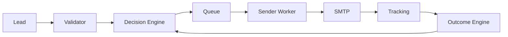

# Architecture

Sovereign Engine is an outbound infrastructure platform built around one principle:

**Decide before sending, then learn from outcomes.**

## Visual Flow

## Components

- **Validator**
  - Validates emails and produces `verdict` + score (valid / risky / invalid / unknown).
- **Decision Engine**
  - Converts validator + domain health + optional intelligence/simulation/outcome signals into an action:
    - send now
    - slow lane
    - defer
    - drop
- **Sending Engine**
  - Enforces caps, rotation, warmup constraints, and safety guardrails.
  - Guarantees idempotent execution (practical exactly-once).
- **Tracking**
  - Writes delivery lifecycle events (`sent`, `failed`, `bounce`, `reply`, etc.) idempotently.
- **Outcome Engine**
  - Aggregates outcomes per segment (domain/inbox/lane/time-window/campaign).
  - Produces outcome signals used to improve future decisions (reply-driven).

## End-to-end Flow (Step-by-step)

1. **Lead enters system**
   - A contact is added to a campaign/sequence.

2. **Validation**
   - The validator determines whether the address is valid/risky/invalid/unknown.

3. **Decision**
   - The decision engine decides what should happen next:
     - send immediately
     - route to slower lane
     - defer to a safer time window
     - drop if unsafe

4. **Queue**
   - The chosen action is enqueued with trace metadata for explainability and audit.

5. **Sending**
   - A sender worker pulls jobs and:
     - acquires an atomic idempotency lock
     - selects an inbox/domain (rotation)
     - enforces caps and warmup limits
     - performs SMTP send

6. **Tracking**
   - On send/fail/bounce/reply, tracking writes events idempotently.
   - These events are the source of truth for outcomes and reporting.

7. **Outcome Loop**
   - Outcome engine computes rolling, noise-resistant metrics (24h/7d).
   - It returns signals like:
     - expected reply probability
     - risk adjustment
     - best time window
     - preferred lane

8. **Feedback Loop**
   - The next decisions incorporate the outcome signals (behind flags / A/B gating).
   - If drift or unsafe behavior is detected, SAFE_MODE disables influence while tracking continues.

## Decision + Outcome Loop (Why this matters)

Most cold email systems optimize for “more sends”. Sovereign Engine optimizes for:

- **domain safety first**
- **reply/meeting outcomes second**

This makes the system:

- measurable (baseline vs treatment)
- explainable (trace + reasons)
- safe under uncertainty (defer/drop + circuit breakers)
