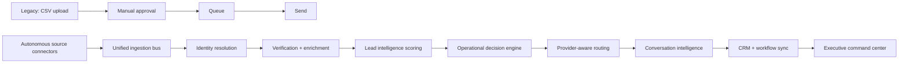
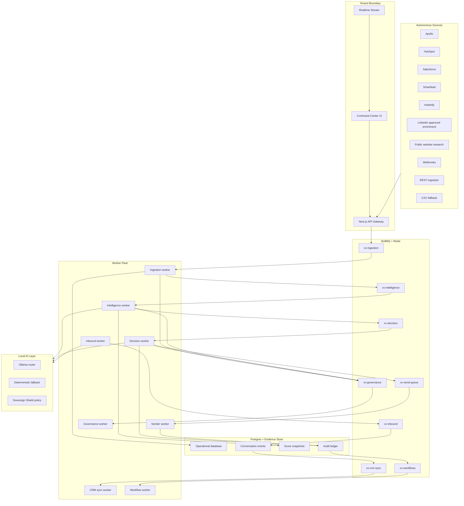
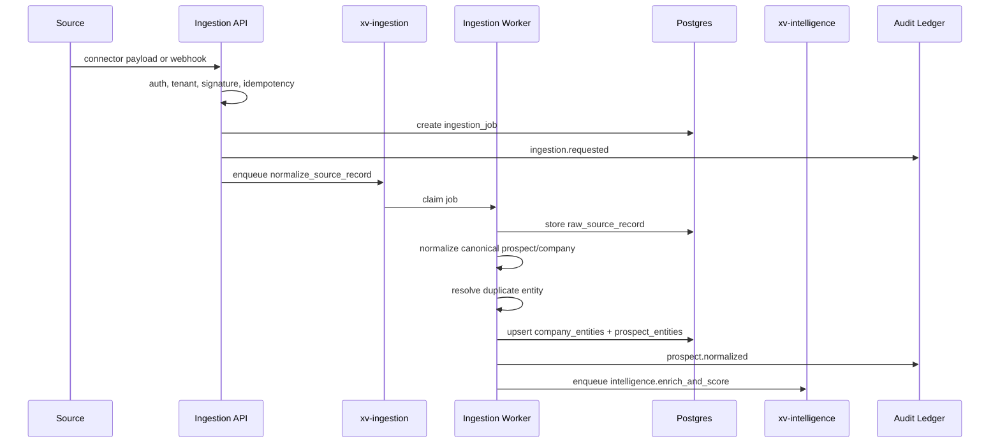
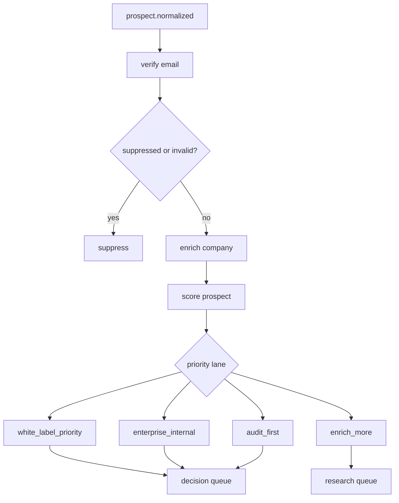
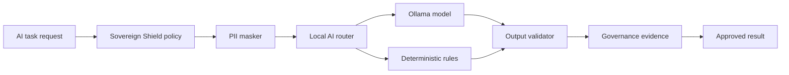
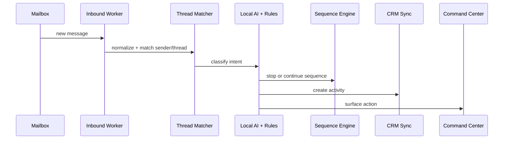

# Xavira Autonomous Enterprise Communication Operating System

Status: implementation architecture
Owner: Xavira Tech Labs
Date: 2026-05-26
Products: Sovereign Engine + Sovereign Shield

## Mission

Xavira Control Stack must evolve from a CSV-assisted outbound platform into an autonomous enterprise communication operations platform. The platform should ingest prospects from trusted systems, verify and enrich them, score commercial fit and operational risk, decide safe actions, route delivery through authenticated infrastructure, detect conversations, sync CRMs, enforce governance, and report executive outcomes in realtime.

The target category is:

```text
Enterprise Communication Governance + Operational Intelligence Platform
```

The platform must not be a CSV sender, lead-gen SaaS, spam platform, or fragile campaign tool. CSV import remains only as a migration and fallback interface.

## Strategic Product Shift



The new operating model is:

```text
Sources -> Ingestion -> Normalization -> Enrichment -> Scoring -> Decision
-> Queue -> Delivery -> Conversation -> CRM -> Governance -> Reporting
```

## Non-Negotiable Architecture Rules

- CSV is a fallback adapter, not the system spine.
- External AI APIs are optional accelerators, not required runtime dependencies.
- Ollama-first local inference is the default AI architecture.
- Deterministic rules must exist for every critical AI decision.
- Every worker job is idempotent.
- Every state transition is audit logged.
- Every tenant action is isolated by tenant ID.
- Every automated send decision has explainable reasons.
- Provider controls are respected through authentication, suppression, validation, and pacing.
- Replies and opt-outs stop sequences immediately.

## Platform Topology



## 1. Autonomous Ingestion Engine

### Purpose

The ingestion engine is the new platform spine. It pulls and receives prospect, organization, campaign, and conversation data from external systems and turns it into canonical, scored, decision-ready entities.

### Source Connectors

| Source | Direction | Primary Entities | Notes |
|---|---|---|---|
| Apollo | pull/import | contacts, accounts | tenant API key, rate-limited |
| HubSpot | bidirectional | contacts, companies, deals, activities | OAuth, webhook support |
| Salesforce | bidirectional | leads, contacts, accounts, opportunities | OAuth, change events |
| Smartlead | pull/webhook | contacts, campaigns, replies | campaign state ingestion |
| Instantly | pull/webhook | leads, campaigns, replies | suppression sync required |
| LinkedIn enrichment | import | profile and company context | approved exports or partner enrichment only |
| Website research | async crawl | public company metadata | robots-aware, rate-limited |
| Webhook | inbound | any canonical event | signed, replay-safe |
| REST API | inbound | prospects, companies, events | idempotent |
| CSV fallback | upload | migration contacts | routes through same ingestion pipeline |

### Ingestion Worker Flow



### Queue Topology

| Queue | Job Types | Retry |
|---|---|---|
| `xv-ingestion` | `connector_pull`, `normalize_source_record`, `resolve_entity` | 5 attempts, exponential |
| `xv-intelligence` | `verify_email`, `enrich_company`, `score_prospect` | 4 attempts, exponential |
| `xv-decision` | `evaluate_outbound_action`, `recalculate_capacity` | 3 attempts, short backoff |
| `xv-send-queue` | `send_touchpoint`, `send_follow_up` | existing sender retry policy |
| `xv-inbound` | `poll_mailbox`, `classify_reply`, `stop_sequence` | 5 attempts |
| `xv-crm-sync` | `upsert_contact`, `create_activity`, `sync_deal` | 8 attempts, long backoff |
| `xv-workflows` | `evaluate_workflow`, `execute_action`, `rollback_action` | 3 attempts |
| `xv-governance` | `policy_check`, `redact_payload`, `write_evidence` | 3 attempts |

### Ingestion API Contracts

#### REST Batch

```http
POST /api/ingestion/batch
Authorization: Bearer <tenant_api_key>
Idempotency-Key: rest:batch_2026_05_26_001
Content-Type: application/json
```

```json
{
  "source": "rest",
  "records": [
    {
      "externalId": "customer-system:123",
      "email": "operator@example.com",
      "firstName": "Maya",
      "lastName": "Chen",
      "title": "Founder",
      "company": {
        "name": "Northstar RevOps",
        "domain": "northstar.example",
        "industry": "RevOps",
        "employeeCount": 55
      },
      "evidence": [
        {
          "type": "crm_owned",
          "url": "https://crm.example/contacts/123"
        }
      ]
    }
  ]
}
```

Response:

```json
{
  "ok": true,
  "jobId": "ing_01J...",
  "accepted": 1,
  "deduped": 0,
  "rejected": 0,
  "next": "intelligence"
}
```

#### Webhook Intake

```http
POST /api/ingestion/webhook/hubspot
X-Xavira-Signature: sha256=<hmac>
X-Xavira-Timestamp: 2026-05-26T13:00:00Z
```

Rules:

- Reject if timestamp drift exceeds 5 minutes.
- Reject if event ID already processed.
- Store raw payload before transformation.
- Return fast and process asynchronously.

#### Connector Pull

```http
POST /api/connectors/:source/pull
Authorization: Bearer <operator_token>
```

Request:

```json
{
  "tenantId": "1",
  "cursor": "optional_cursor",
  "limit": 100
}
```

Response:

```json
{
  "ok": true,
  "queued": true,
  "queue": "xv-ingestion",
  "jobId": "pull_01J..."
}
```

### Normalization Layer

Canonical prospect shape:

```ts
export type CanonicalProspect = {
  tenantId: string
  source: string
  externalId: string
  email: string
  normalizedEmail: string
  firstName?: string
  lastName?: string
  title?: string
  seniority: 'founder' | 'executive' | 'director' | 'manager' | 'operator' | 'unknown'
  companyName?: string
  companyDomain?: string
  sourceTrust: number
  evidence: Array<{
    type: 'crm_owned' | 'public_page' | 'partner_enrichment' | 'manual_import' | 'webhook'
    url?: string
    observedAt: string
  }>
  rawRecordId: string
}
```

Normalization rules:

- Email lowercase, trim, reject encoded artifacts.
- Company domain canonicalized to registrable root.
- Source trust score comes from connector registry.
- Missing company domain triggers domain intelligence job.
- CRM-owned records outrank public enrichment records.
- Suppression and unsubscribe state always override source data.

### Entity Resolution

Resolution order:

1. `tenant_id + normalized_email`
2. `tenant_id + source + external_id`
3. `tenant_id + company_domain + first_name + last_name`
4. `tenant_id + company_domain + title + source_url`

Resolution outcomes:

- `matched_existing`
- `created_new`
- `merged_alias`
- `conflict_review`
- `rejected`

## 2. Lead Intelligence Engine

### Purpose

The lead intelligence engine ranks prospects based on commercial value, operational fit, governance need, and delivery risk.

### Scoring Model

All scores use `0.0` to `1.0` and store reasons.

#### Outbound Readiness

```text
outbound_readiness =
  0.25 * email_quality
+ 0.20 * evidence_quality
+ 0.15 * company_domain_quality
+ 0.15 * role_relevance
+ 0.15 * source_trust
+ 0.10 * prior_engagement_signal
```

#### Infrastructure Maturity

```text
infrastructure_maturity =
  0.20 * employee_count_fit
+ 0.20 * technical_stack_signal
+ 0.20 * outbound_operations_signal
+ 0.15 * compliance_language_signal
+ 0.15 * multi_provider_signal
+ 0.10 * revenue_stage_signal
```

#### Deliverability Risk

```text
deliverability_risk =
  0.30 * validation_uncertainty
+ 0.20 * role_inbox_risk
+ 0.15 * previous_bounce_history
+ 0.15 * domain_mx_risk
+ 0.10 * catch_all_risk
+ 0.10 * source_quality_risk
```

#### Agency Fit

```text
agency_fit =
  0.25 * agency_category_match
+ 0.25 * outbound_service_signal
+ 0.20 * multi_client_signal
+ 0.15 * white_label_fit
+ 0.15 * commercial_capacity
```

#### Enterprise Value

```text
enterprise_value =
  0.25 * company_size_fit
+ 0.20 * budget_capacity_signal
+ 0.20 * strategic_pain_signal
+ 0.15 * governance_need
+ 0.10 * urgency_signal
+ 0.10 * source_trust
```

#### AI Governance Fit

```text
ai_governance_fit =
  0.25 * ai_product_signal
+ 0.20 * security_signal
+ 0.20 * data_sensitivity_signal
+ 0.15 * audit_need_signal
+ 0.10 * local_ai_need
+ 0.10 * compliance_signal
```

#### Licensing Probability

```text
licensing_probability =
  0.25 * enterprise_value
+ 0.20 * max(agency_fit, ai_governance_fit)
+ 0.20 * infrastructure_maturity
+ 0.15 * outbound_readiness
+ 0.10 * decision_maker_relevance
+ 0.10 * pain_intensity
- 0.15 * deliverability_risk
```

### Ranking Lanes

| Lane | Criteria | Recommended Offer |
|---|---|---|
| `white_label_priority` | high agency fit and licensing probability | £100,000 GBP white-label commercial license |
| `enterprise_internal` | high enterprise value and governance fit | £25,000 GBP internal enterprise license |
| `audit_first` | high pain, medium readiness | infrastructure review |
| `enrich_more` | high company fit, weak evidence | more research |
| `hold` | risk high or evidence weak | do not send |
| `suppress` | invalid, bounced, unsubscribed | block |

### Automated Qualification Workflow



## 3. Autonomous Outbound Decision Engine

### Purpose

The decision engine is the operator brain. It decides if the platform should communicate, when, from which identity, through which provider, at what pace, and under which governance constraints.

### Decision Input

```ts
export type DecisionInput = {
  tenantId: string
  prospectId: string
  sequenceId?: string
  scores: {
    outboundReadiness: number
    licensingProbability: number
    deliverabilityRisk: number
    agencyFit: number
    aiGovernanceFit: number
  }
  email: {
    address: string
    verdict: 'valid' | 'risky' | 'invalid' | 'unknown'
  }
  suppression: {
    suppressed: boolean
    reason?: string
  }
  domainHealth: {
    spfValid: boolean
    dkimValid: boolean
    dmarcValid: boolean
    bounceRate24h: number
    failureRate24h: number
    remainingCapacity: number
  }
  providerHealth: Array<{
    provider: string
    available: boolean
    failureRate24h: number
    remainingCapacity: number
  }>
  tenantPolicy: Record<string, unknown>
}
```

### Decision Output

```ts
export type DecisionOutput = {
  action: 'send' | 'defer' | 'review' | 'drop' | 'stop_sequence'
  lane: 'standard' | 'low_risk' | 'recovery' | 'manual_review'
  provider?: 'resend' | 'smtp' | 'future_provider'
  senderIdentity?: string
  sendAfter?: string
  followUpAfterDays?: number
  reasons: string[]
  riskScore: number
  auditTraceId: string
}
```

### Decision Logic

```text
1. If suppressed, replied, bounced hard, or unsubscribed -> stop_sequence.
2. If email invalid -> drop.
3. If evidence is weak -> review.
4. If DNS auth is incomplete -> review or defer based on tenant policy.
5. If domain pressure is high -> defer.
6. If provider pressure is high -> route to healthier provider or defer.
7. If deliverability risk is high -> low_risk lane or review.
8. If capacity is exhausted -> defer.
9. If commercial score is low -> enrich_more or hold.
10. If all gates pass -> send with explainable provider and identity selection.
```

### Recipient Ecosystem Logic

| Ecosystem | Detection | Safe Behavior |
|---|---|---|
| Gmail / Google Workspace | MX contains Google | low concurrency, strong auth, monitor DSN patterns |
| Outlook / Microsoft 365 | MX contains protection.outlook.com | conservative pacing, strict bounce memory |
| Yahoo / AOL | Yahoo MX | lower hourly pressure, careful retry policy |
| Custom corporate MX | other MX | require stronger evidence and verification |

The system does not attempt to evade provider filtering. It uses authentication, suppression, verification, pacing, and feedback loops.

### Reputation Protection Engine

Signals:

- Bounce rate by domain.
- Failure rate by provider.
- Retry age.
- Complaint/unsubscribe signals.
- DSN pattern changes.
- Reply sentiment.
- Authentication validity.
- Queue age.

Actions:

- Pause sender identity.
- Pause domain.
- Lower per-hour caps.
- Shift lane.
- Defer new prospects.
- Stop follow-ups.
- Trigger incident workflow.
- Notify Telegram and Command Center.

## 4. Local AI Governance Engine

### Architecture



### AI Runtime Rules

- `Ollama` is the default inference provider.
- External providers are disabled unless explicitly enabled by tenant policy.
- Deterministic fallback must exist for classification, scoring, policy checks, and copy review.
- All prompts and outputs are logged as redacted governance evidence.
- PII masking happens before model calls.
- Model failures must never block critical safety actions.

### Model Routing

| Task | Primary | Fallback |
|---|---|---|
| reply classification | Ollama small classifier | deterministic regex/rules |
| objection summary | Ollama instruct model | templated summary |
| lead category inference | deterministic signals + Ollama | deterministic signals |
| copy risk review | policy engine | blocked if uncertain |
| PII detection | deterministic patterns | conservative redaction |
| executive summary | Ollama | metric-only summary |

### Governance Policies

| Policy | Enforcement |
|---|---|
| source provenance | require source URL or CRM ownership before approval |
| PII minimization | redact sensitive fields from model prompts |
| copy truthfulness | block unsupported claims and guaranteed outcomes |
| suppression respect | hard block before queueing |
| local-first AI | prefer Ollama, external disabled by default |
| auditability | append-only evidence per decision |
| retention | redact message bodies after review window |

## 5. Enterprise Workflow Orchestration

### Workflow Engine Model

```ts
export type WorkflowDefinition = {
  id: string
  tenantId: string
  name: string
  version: number
  enabled: boolean
  trigger: {
    eventType: string
    filters: Record<string, unknown>
  }
  conditions: Array<{
    field: string
    operator: 'eq' | 'neq' | 'gt' | 'gte' | 'lt' | 'lte' | 'contains'
    value: unknown
  }>
  actions: Array<{
    type: string
    input: Record<string, unknown>
  }>
  rollbackActions: Array<{
    type: string
    input: Record<string, unknown>
  }>
}
```

### Workflow Types

| Workflow | Trigger | Actions |
|---|---|---|
| Lead qualification | `prospect.scored` | approve, enrich, review, hold |
| Incident automation | `provider.health_degraded` | pause lane, notify, open incident |
| Governance review | `governance.policy_blocked` | create review task, stop action |
| Conversation escalation | `conversation.interested` | stop sequence, notify, CRM task |
| Reputation recovery | `domain.bounce_pressure` | reduce caps, pause risky lane |
| CRM update | `delivery.sent` or `conversation.classified` | sync activity |
| Follow-up control | `sequence.step_due` | evaluate before queueing |

### Playbook Example

```text
Trigger: conversation.classified
Condition: classification in [interested, pricing_interest, partnership_interest]
Actions:
  1. stop active sequence
  2. create CRM activity
  3. notify Telegram
  4. create operator task
  5. add to executive report
Rollback:
  1. mark task cancelled if classification is corrected
```

## 6. Realtime Command Center

### UX Structure

```text
Command Center
  Executive Overview
  Source Ingestion
  Prospect Intelligence
  Decision Engine
  Delivery Infrastructure
  Conversation Intelligence
  Governance Ledger
  CRM Sync
  Workflow Automation
  Tenant Operations
  Licensing Control
```

### Executive Overview Cards

- Active tenants.
- Ingestion velocity.
- Verified prospects.
- Decision-ready prospects.
- Delivery confidence.
- Provider health.
- Conversations requiring action.
- Licensing opportunities.
- Governance blocks.
- Incident count.

### Infrastructure Map

Must show:

- Worker topology.
- Queue depth.
- Queue age p95.
- Redis latency.
- Postgres latency.
- Provider lane health.
- Sender identity capacity.
- Domain authentication state.
- Inbound worker state.
- CRM sync state.

### Interaction Model

- Click a queue -> see oldest jobs, failure reasons, retry age.
- Click a domain -> see auth, capacity, bounce pressure, sends.
- Click a prospect -> see source evidence, score, decision trace.
- Click a reply -> see classification, matched prospect, recommended next action.
- Click an incident -> see trigger event, affected systems, actions taken.

## 7. Multi-Tenant Enterprise Architecture

### Isolation Model

Every operational object belongs to a tenant:

- source connections
- raw records
- prospects
- companies
- scores
- decisions
- queue jobs
- sender identities
- conversations
- CRM sync state
- workflow definitions
- governance evidence
- licensing entitlements

### RBAC Model

| Role | Access |
|---|---|
| Owner | license, billing, tenant policy, all operations |
| Admin | connectors, domains, workflows, users |
| Operator | queues, reviews, conversations, CRM tasks |
| Analyst | reports and read-only metrics |
| Auditor | governance evidence and audit exports |

### White-Label Boundaries

- Parent tenant owns license.
- Child tenants have isolated data, domains, and connectors.
- Parent can view aggregate operations if contract allows.
- Child tenant data cannot leak into another child tenant.
- Branding, domains, and support routing are tenant-scoped.

### Licensing Enforcement

Capabilities:

- internal enterprise license
- white-label license
- connector count
- child tenant count
- identity count
- workflow automation
- local AI governance
- executive reporting
- CRM sync
- commercial deployment rights

Enforcement must happen in APIs and workers, not only in the UI.

## 8. Conversation Intelligence

### Reply Processing Flow



### Classification Labels

- `interested`
- `pricing_interest`
- `partnership_interest`
- `licensing_interest`
- `objection`
- `not_interested`
- `unsubscribe`
- `bounce_or_dsn`
- `auto_reply`
- `neutral`

### Opportunity Score

```text
opportunity_score =
  0.30 * intent_strength
+ 0.20 * licensing_signal
+ 0.20 * company_value
+ 0.15 * urgency_signal
+ 0.10 * role_seniority
+ 0.05 * sentiment_positive
```

### Executive Escalation

Escalate when:

- licensing interest is detected.
- partnership interest is detected.
- pricing is requested.
- a founder or executive replies positively.
- an objection can be handled with a demo or audit.
- a negative reply indicates compliance risk.

## 9. DB Schema

```sql
CREATE TABLE source_connections (
  id BIGSERIAL PRIMARY KEY,
  tenant_id BIGINT NOT NULL,
  source_type TEXT NOT NULL,
  status TEXT NOT NULL DEFAULT 'active',
  auth_type TEXT NOT NULL DEFAULT 'api_key',
  encrypted_credentials TEXT,
  source_trust NUMERIC NOT NULL DEFAULT 0.5,
  rate_limit_per_minute INT NOT NULL DEFAULT 60,
  cursor TEXT,
  created_at TIMESTAMPTZ DEFAULT now(),
  updated_at TIMESTAMPTZ DEFAULT now(),
  UNIQUE (tenant_id, source_type)
);

CREATE TABLE ingestion_jobs (
  id UUID PRIMARY KEY DEFAULT gen_random_uuid(),
  tenant_id BIGINT NOT NULL,
  source_type TEXT NOT NULL,
  idempotency_key TEXT NOT NULL,
  status TEXT NOT NULL DEFAULT 'queued',
  accepted_count INT NOT NULL DEFAULT 0,
  normalized_count INT NOT NULL DEFAULT 0,
  rejected_count INT NOT NULL DEFAULT 0,
  error_summary TEXT,
  created_at TIMESTAMPTZ DEFAULT now(),
  updated_at TIMESTAMPTZ DEFAULT now(),
  UNIQUE (tenant_id, source_type, idempotency_key)
);

CREATE TABLE raw_source_records (
  id UUID PRIMARY KEY DEFAULT gen_random_uuid(),
  tenant_id BIGINT NOT NULL,
  ingestion_job_id UUID REFERENCES ingestion_jobs(id),
  source_type TEXT NOT NULL,
  external_id TEXT,
  payload_hash TEXT NOT NULL,
  payload JSONB NOT NULL,
  created_at TIMESTAMPTZ DEFAULT now(),
  UNIQUE (tenant_id, source_type, external_id)
);

CREATE TABLE lead_intelligence_scores (
  id UUID PRIMARY KEY DEFAULT gen_random_uuid(),
  tenant_id BIGINT NOT NULL,
  prospect_id UUID NOT NULL,
  outbound_readiness NUMERIC NOT NULL,
  infrastructure_maturity NUMERIC NOT NULL,
  deliverability_risk NUMERIC NOT NULL,
  agency_fit NUMERIC NOT NULL,
  enterprise_value NUMERIC NOT NULL,
  ai_governance_fit NUMERIC NOT NULL,
  licensing_probability NUMERIC NOT NULL,
  priority_lane TEXT NOT NULL,
  reasons JSONB NOT NULL DEFAULT '[]',
  scored_at TIMESTAMPTZ DEFAULT now()
);

CREATE TABLE operational_decisions (
  id UUID PRIMARY KEY DEFAULT gen_random_uuid(),
  tenant_id BIGINT NOT NULL,
  prospect_id UUID,
  action TEXT NOT NULL,
  lane TEXT NOT NULL,
  provider TEXT,
  sender_identity TEXT,
  send_after TIMESTAMPTZ,
  risk_score NUMERIC NOT NULL,
  reasons JSONB NOT NULL DEFAULT '[]',
  audit_trace_id UUID NOT NULL,
  created_at TIMESTAMPTZ DEFAULT now()
);

CREATE TABLE conversation_intelligence (
  id UUID PRIMARY KEY DEFAULT gen_random_uuid(),
  tenant_id BIGINT NOT NULL,
  prospect_id UUID,
  message_id TEXT,
  from_email TEXT NOT NULL,
  subject TEXT,
  classification TEXT NOT NULL,
  opportunity_score NUMERIC NOT NULL DEFAULT 0,
  summary TEXT,
  recommended_action TEXT,
  evidence JSONB NOT NULL DEFAULT '{}',
  created_at TIMESTAMPTZ DEFAULT now(),
  UNIQUE (tenant_id, message_id)
);

CREATE TABLE workflow_definitions (
  id UUID PRIMARY KEY DEFAULT gen_random_uuid(),
  tenant_id BIGINT NOT NULL,
  name TEXT NOT NULL,
  version INT NOT NULL DEFAULT 1,
  enabled BOOLEAN NOT NULL DEFAULT false,
  trigger_type TEXT NOT NULL,
  definition JSONB NOT NULL,
  created_at TIMESTAMPTZ DEFAULT now(),
  updated_at TIMESTAMPTZ DEFAULT now()
);

CREATE TABLE governance_evidence (
  id UUID PRIMARY KEY DEFAULT gen_random_uuid(),
  tenant_id BIGINT NOT NULL,
  trace_id UUID NOT NULL,
  event_type TEXT NOT NULL,
  actor_type TEXT NOT NULL,
  actor_id TEXT,
  payload JSONB NOT NULL,
  created_at TIMESTAMPTZ DEFAULT now()
);
```

## 10. API Surface

| API | Method | Purpose |
|---|---|---|
| `/api/ingestion/batch` | POST | ingest REST or fallback CSV-normalized records |
| `/api/ingestion/webhook/[source]` | POST | signed webhook ingestion |
| `/api/connectors` | GET/POST | manage tenant connectors |
| `/api/connectors/[source]/pull` | POST | enqueue connector pull |
| `/api/intelligence/prospects/[id]/score` | POST | re-score a prospect |
| `/api/decision/evaluate` | POST | evaluate operational decision |
| `/api/command-center/graph` | GET | realtime command center data |
| `/api/conversations` | GET | reply intelligence and actions |
| `/api/workflows` | GET/POST | workflow definitions |
| `/api/crm/sync/run` | POST | queue CRM sync |
| `/api/governance/evidence` | GET | audit evidence search |

## 11. Deployment Topology

### Small Runtime

```text
Render web service
  api-gateway
  embedded sender-worker concurrency 1
  embedded outbound-cycle-worker
  embedded inbound-worker if memory allows

Managed services
  Postgres
  Redis
```

### Enterprise Runtime

```text
api-gateway x N
websocket-gateway x N
ingestion-worker x N
intelligence-worker x N
decision-worker x N
sender-worker x N
inbound-worker x N
crm-sync-worker x N
workflow-worker x N
governance-worker x N
postgres primary + read replicas
redis cluster
ollama inference nodes
object storage for exports
```

## 12. Commercialization Upgrade

### Enterprise Value Narrative

Xavira Control Stack gives enterprises a governed communication operating system. It connects prospect sources, scores commercial value, protects reputation, routes communication safely, captures conversations, updates CRM systems, and creates compliance evidence.

### Pricing Justification

#### £25,000 GBP Internal Enterprise License

Justified by:

- operational command center
- local AI governance
- provider-aware communication infrastructure
- audit evidence
- CRM synchronization
- workflow automation
- deployment support
- internal usage rights

#### £100,000 GBP White-Label Commercial License

Justified by:

- reseller rights
- commercial deployment rights
- multi-tenant operations
- white-label boundaries
- client-specific governance
- operational reporting
- support and deployment enablement

#### £3,000 GBP/month Operations & Maintenance

Justified by:

- monitoring
- updates
- connector maintenance
- workflow tuning
- deliverability diagnostics
- governance policy updates
- incident support
- operational reporting

## Implementation Sequence

1. Build autonomous ingestion foundation.
2. Route CSV through ingestion as fallback.
3. Add lead intelligence scoring.
4. Extract operational decision engine.
5. Add Ollama-first governance router.
6. Add conversation intelligence table and dashboard.
7. Add CRM sync outbox.
8. Add workflow engine.
9. Upgrade Command Center.
10. Add tenant licensing boundaries.

## Success Metrics

- Percentage of leads ingested from connectors instead of CSV.
- Verified prospects created per day.
- Evidence-backed prospect rate.
- Decision-ready prospect count.
- Conversation classifications.
- Sequences stopped on replies.
- CRM sync success rate.
- Governance policy decisions.
- Incidents resolved automatically.
- Licensing opportunities created.

The business metric is not raw email volume. The business metric is governed opportunity creation.
