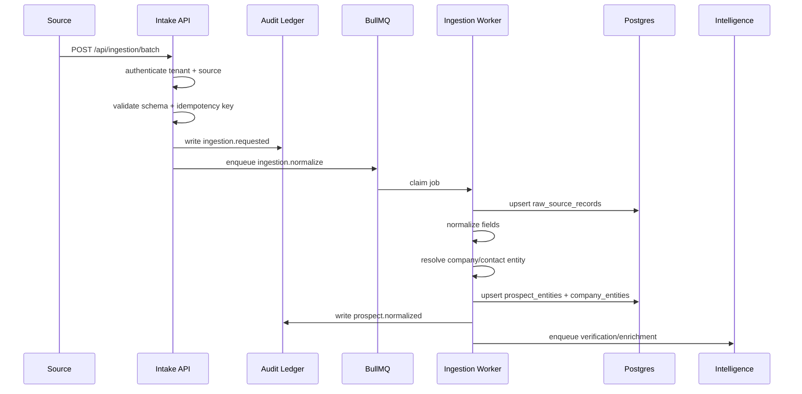
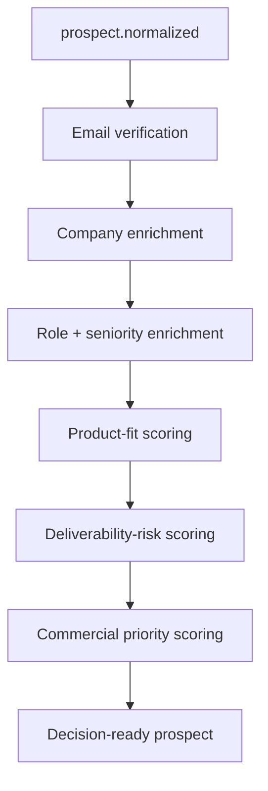
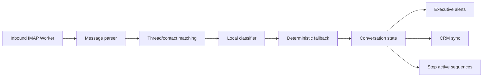
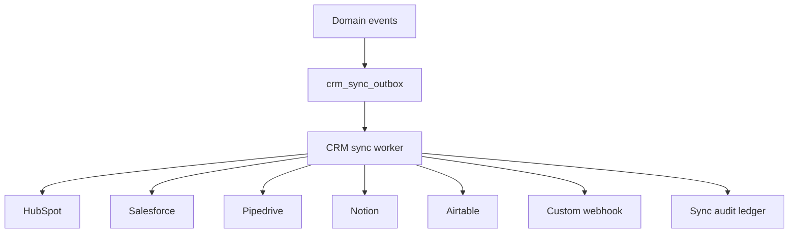

# Xavira Control Stack - Enterprise Communication Operations OS

Status: architecture blueprint
Owner: Xavira Tech Labs
Scope: Sovereign Engine + Sovereign Shield
Date: 2026-05-26

## Executive Thesis

Xavira Control Stack must not be positioned or implemented as a CSV sender. It should become an enterprise communication governance and operational intelligence platform: a control plane that ingests prospect signals from many systems, verifies and enriches them, decides safe operational actions, routes delivery through provider-aware infrastructure, detects conversations, synchronizes CRM state, and gives executives a realtime view of communication risk and revenue movement.

The core shift is:

```text
Old model:
CSV -> queue -> send

New model:
Unified Prospect Intelligence Layer
-> Verification
-> Enrichment
-> Risk Scoring
-> Operational Decision Engine
-> Adaptive Infrastructure Routing
-> Provider-Aware Delivery
-> Conversation Intelligence
-> CRM Synchronization
-> Realtime Governance
-> Executive Reporting
```

This makes the platform feel like enterprise middleware and operational infrastructure, not an outreach tool.

## North Star Architecture

```mermaid
flowchart LR
  subgraph Sources["External Systems"]
    Apollo["Apollo"]
    HubSpot["HubSpot"]
    Salesforce["Salesforce"]
    Clay["Clay"]
    Smartlead["Smartlead"]
    Instantly["Instantly"]
    LinkedIn["LinkedIn enrichment"]
    Website["Website/company research"]
    Webhook["REST + webhooks"]
    CSV["CSV fallback"]
  end

  subgraph Ingestion["Unified Ingestion Layer"]
    Registry["Connector registry"]
    Intake["Intake API"]
    Normalize["Normalization"]
    Resolve["Entity resolution"]
    IngestQueue["BullMQ ingestion queues"]
  end

  subgraph Intelligence["Prospect Intelligence Engine"]
    Verify["Verification"]
    Enrich["Company + role enrichment"]
    Score["Fit + risk scoring"]
    Evidence["Evidence ledger"]
  end

  subgraph Decision["Operational Decision Engine"]
    Policy["Tenant policies"]
    Lane["Provider lane selection"]
    Timing["Send window logic"]
    Brake["Emergency brake"]
  end

  subgraph Delivery["Provider-Aware Delivery"]
    Queue["Adaptive send queue"]
    Sender["Sender workers"]
    Providers["Resend / SMTP / future ESPs"]
  end

  subgraph Conversation["Conversation Intelligence"]
    IMAP["Inbound worker"]
    Classifier["Reply classifier"]
    Escalation["Human escalation"]
  end

  subgraph Sync["CRM Synchronization"]
    Outbox["Event outbox"]
    CRM["HubSpot / Salesforce / Pipedrive / Notion / Airtable"]
  end

  subgraph Command["Executive Command Center"]
    Map["Infrastructure map"]
    Revenue["Revenue-risk monitor"]
    Governance["Compliance evidence"]
    Ops["Operational anomalies"]
  end

  Sources --> Registry --> Intake --> Normalize --> Resolve --> IngestQueue
  IngestQueue --> Verify --> Enrich --> Score --> Evidence
  Score --> Policy --> Lane --> Timing --> Brake --> Queue --> Sender --> Providers
  Providers --> IMAP --> Classifier --> Escalation
  Classifier --> Outbox --> CRM
  Evidence --> Command
  Decision --> Command
  Delivery --> Command
  Conversation --> Command
```



## Product Positioning

### Company Positioning

Xavira Tech Labs builds enterprise communication governance infrastructure for teams that need outbound operations, AI governance, evidence-backed workflows, and operational reliability under one control plane.

### Product Positioning

Sovereign Engine is the communication operations layer: ingestion, verification, scoring, queueing, provider-aware delivery, reply detection, sequence control, and operational reporting.

Sovereign Shield is the governance layer: PII masking, AI safety policy, prompt risk controls, audit evidence, local model routing, compliance controls, and policy enforcement.

Xavira Control Stack is the combined enterprise platform: communication intelligence plus AI governance plus operational command center.

### Commercial Positioning

The platform is not sold as "email software." It is sold as infrastructure licensing:

- Internal enterprise license for teams using the stack inside their own organization.
- White-label commercial license for agencies, consultancies, and operators deploying the platform for clients.
- Operations and maintenance retainers for monitoring, upgrades, deployment help, and incident response.

## 1. Unified Ingestion Layer

### Objective

Replace CSV dependency with a multi-source, idempotent ingestion control layer. CSV remains only as a fallback path for legacy import.

### Connector Families

| Connector | Primary Use | Ingestion Mode | Risk Notes |
|---|---|---|---|
| Apollo | prospect/company import | API pull + webhook | API limits, consent rules |
| HubSpot | CRM contacts/deals | OAuth + webhook | field ownership conflicts |
| Salesforce | enterprise CRM | OAuth + change data capture | strict tenant isolation |
| Clay | enrichment results | API + webhook | source provenance required |
| Smartlead | campaign and contact state | API pull + webhook | suppression sync required |
| Instantly | campaign and contact state | API pull + webhook | sequence state conflicts |
| LinkedIn enrichment | profile/company context | approved enrichment source only | avoid unauthorized scraping |
| Website/company research | public site metadata | crawler queue | robots and rate limits |
| REST ingestion API | custom systems | signed API key | idempotency required |
| Webhook ingestion | event-driven intake | signed webhook | replay protection required |
| CSV fallback | migration/import only | upload job | never primary path |

### Ingestion Flow



### API Contracts

#### Batch Ingestion

`POST /api/ingestion/batch`

Headers:

```http
Authorization: Bearer <tenant_api_key>
Idempotency-Key: source:external_batch_id
X-Xavira-Source: hubspot|salesforce|apollo|clay|smartlead|instantly|rest|csv
```

Request:

```json
{
  "source": "hubspot",
  "tenantId": "tenant_123",
  "records": [
    {
      "externalId": "hubspot:contact:9821",
      "email": "founder@example.com",
      "firstName": "Asha",
      "lastName": "Rao",
      "title": "Founder",
      "company": {
        "name": "Northstar RevOps",
        "domain": "northstar.example",
        "employeeCount": 45,
        "industry": "RevOps"
      },
      "sourceUrl": "https://app.hubspot.com/contacts/9821",
      "consentBasis": "public_business_contact",
      "metadata": {
        "listName": "Outbound infrastructure targets"
      }
    }
  ]
}
```

Response:

```json
{
  "ok": true,
  "ingestionJobId": "ing_01J...",
  "accepted": 1,
  "deduped": 0,
  "rejected": 0,
  "queue": "xv-ingestion",
  "next": "verification_and_scoring"
}
```

#### Webhook Ingestion

`POST /api/ingestion/webhook/:source`

Headers:

```http
X-Xavira-Signature: hmac_sha256(payload, source_secret)
X-Xavira-Timestamp: 2026-05-26T00:00:00Z
```

Rules:

- Reject if timestamp drift is greater than 5 minutes.
- Reject duplicate webhook event IDs.
- Store raw payload before transformation.
- Queue transformation asynchronously.
- Return quickly to prevent provider timeout.

#### Job Status

`GET /api/ingestion/jobs/:id`

Response:

```json
{
  "id": "ing_01J...",
  "status": "processing",
  "source": "hubspot",
  "accepted": 120,
  "normalized": 118,
  "deduped": 2,
  "rejected": 0,
  "createdAt": "2026-05-26T00:00:00Z",
  "auditTraceId": "audit_01J..."
}
```

### Retry Strategy

| Failure Type | Action | Backoff |
|---|---|---|
| provider 429 | defer connector pull | exponential, max 6h |
| malformed record | reject record, continue batch | no retry |
| transient DB error | retry job | 30s, 2m, 10m |
| duplicate idempotency key | return original job | no retry |
| webhook signature fail | reject and audit | no retry |
| entity resolution conflict | queue human review | no retry until resolved |

### Data Normalization

Canonical prospect:

```ts
export type CanonicalProspect = {
  tenantId: string
  externalRefs: Array<{ source: string; externalId: string }>
  email: string
  emailNormalized: string
  firstName?: string
  lastName?: string
  title?: string
  seniority?: 'founder' | 'executive' | 'director' | 'manager' | 'operator' | 'unknown'
  companyName?: string
  companyDomain?: string
  sourceUrl?: string
  consentBasis?: 'public_business_contact' | 'crm_owned' | 'partner_supplied' | 'manual_review'
  evidence: Array<{ type: string; url?: string; observedAt: string }>
  raw: Record<string, unknown>
}
```

Normalization rules:

- Lowercase and trim email.
- Reject HTML-escaped artifacts like `u003e`.
- Extract root domain from email and website.
- Convert source-specific lifecycle states into canonical states.
- Preserve raw source payload for audit but never use raw fields directly for sending.

### Entity Resolution

Resolution keys, in priority order:

1. `tenant_id + normalized_email`
2. `tenant_id + source + external_id`
3. `tenant_id + company_domain + first_name + last_name`
4. `tenant_id + company_domain + title + source_evidence_url`

Conflict policy:

- CRM-owned fields win over scraped fields.
- Most recent verified email status wins over older unknown status.
- Suppression and unsubscribe always win.
- If two companies share a similar name but different domains, do not merge automatically.

## 2. Prospect Intelligence Engine

### Objective

Convert raw contacts into ranked enterprise opportunities with fit, risk, evidence, and recommended action.

### Intelligence Pipeline



### Scoring Formulas

All scores are 0.0 to 1.0 and stored with reasons.

#### Outbound Readiness Score

```text
outbound_readiness =
  0.25 * valid_business_email
+ 0.20 * domain_has_mx
+ 0.15 * role_relevance
+ 0.15 * company_size_fit
+ 0.15 * evidence_quality
+ 0.10 * source_trust
```

#### Infrastructure Fit Score

```text
infrastructure_fit =
  0.25 * outbound_heavy_signal
+ 0.20 * revops_or_agency_signal
+ 0.15 * technical_complexity_signal
+ 0.15 * provider_stack_signal
+ 0.15 * growth_stage_signal
+ 0.10 * pain_language_signal
```

Signals include hiring SDRs, mentioning Apollo/Smartlead/Instantly, running outbound services, deliverability content, RevOps offerings, or compliance-heavy positioning.

#### AI Governance Fit Score

```text
ai_governance_fit =
  0.25 * ai_product_signal
+ 0.20 * security_or_compliance_signal
+ 0.20 * regulated_data_signal
+ 0.15 * enterprise_customer_signal
+ 0.10 * audit_or_policy_language
+ 0.10 * local_model_need
```

#### Agency Fit Score

```text
agency_fit =
  0.30 * agency_or_consultancy_category
+ 0.25 * outbound_service_signal
+ 0.15 * multi_client_operations_signal
+ 0.15 * white_label_fit
+ 0.15 * revenue_capacity_signal
```

#### Deliverability Risk Score

```text
deliverability_risk =
  0.30 * email_validation_risk
+ 0.20 * role_inbox_risk
+ 0.15 * domain_age_or_mx_risk
+ 0.15 * previous_bounce_history
+ 0.10 * catch_all_uncertainty
+ 0.10 * source_quality_risk
```

#### Enterprise Priority Score

```text
enterprise_priority =
  0.30 * max(infrastructure_fit, ai_governance_fit)
+ 0.20 * agency_fit
+ 0.20 * outbound_readiness
+ 0.15 * commercial_capacity
+ 0.10 * source_trust
- 0.15 * deliverability_risk
```

### Prioritization Lanes

| Lane | Criteria | Action |
|---|---|---|
| `enterprise_direct` | high infrastructure or AI governance fit | £25,000 GBP internal enterprise license positioning |
| `agency_white_label` | high agency fit and commercial capacity | £100,000 GBP white-label commercial license positioning |
| `audit_first` | high pain, medium readiness | offer infrastructure review |
| `research_more` | high company fit, weak evidence | enrich before outreach |
| `do_not_contact` | invalid, suppressed, high risk, no evidence | block |

## 3. Operational Decision Engine

### Objective

Make every action explainable before it reaches the send queue. The engine decides whether to send, when to send, which identity to use, which provider lane is safest, and when to stop.

### Decision Inputs

- Prospect readiness score.
- Deliverability risk score.
- Tenant policy.
- Suppression state.
- Sequence state.
- Sender identity capacity.
- Domain authentication state.
- Provider health.
- Recent bounces/failures.
- Reply status.
- Governance policy.
- Time-window policy.

### Decision Output

```ts
export type OperationalDecision = {
  action: 'send' | 'defer' | 'drop' | 'review' | 'stop_sequence'
  lane: 'low_risk' | 'standard' | 'recovery' | 'manual_review'
  providerPreference: Array<'resend' | 'smtp' | 'future_provider'>
  senderDomain?: string
  senderIdentity?: string
  sendAfter?: string
  reasons: string[]
  riskScore: number
  auditTraceId: string
}
```

### Decision Pseudocode

```ts
export function evaluateOperationalDecision(input: DecisionInput): OperationalDecision {
  if (input.suppressed || input.unsubscribed || input.replied) {
    return stop('stop_sequence', 'suppression_or_reply_state')
  }

  if (!input.email.valid || input.email.verdict === 'invalid') {
    return drop('invalid_email')
  }

  if (!input.domain.spfValid || !input.domain.dkimValid) {
    return review('domain_authentication_incomplete')
  }

  if (input.providerHealth.failureRate24h > 0.08) {
    return defer('provider_failure_pressure')
  }

  if (input.domainHealth.bounceRate24h > 0.03) {
    return defer('domain_bounce_pressure')
  }

  if (input.deliverabilityRisk >= 0.7) {
    return review('deliverability_risk_high')
  }

  if (input.capacity.remainingToday <= 0) {
    return defer('daily_capacity_exhausted')
  }

  return send({
    lane: input.email.verdict === 'risky' ? 'low_risk' : 'standard',
    providerPreference: rankProviders(input),
    senderIdentity: chooseIdentity(input),
    sendAfter: chooseSendWindow(input),
    reasons: ['verified', 'capacity_available', 'policy_allowed']
  })
}
```

### Provider Lane Logic

| Recipient Ecosystem | Signals | Default Action |
|---|---|---|
| Gmail / Google Workspace | MX contains Google | prefer authenticated low-risk lane, conservative ramp |
| Outlook / Microsoft 365 | MX contains protection.outlook.com | stricter bounce memory, conservative retry |
| Yahoo / AOL | Yahoo MX | reduce concurrency and monitor deferrals |
| Corporate custom MX | non-standard MX | require stronger validation before sending |

No lane attempts to bypass provider filtering. The goal is authenticated, expected, compliant delivery with clear provenance and suppression controls.

### Emergency Brake

Trigger emergency brake when:

- Bounce rate exceeds tenant policy.
- Complaint/unsubscribe signal detected.
- Provider auth failure repeats.
- Queue retries exceed threshold.
- DNS authentication becomes invalid.
- Memory pressure causes worker instability.
- Inbound replies indicate negative sentiment spike.

Brake actions:

- Pause affected sender identities.
- Stop new sends for impacted domain.
- Continue inbound processing.
- Notify Telegram and Command Center.
- Write governance evidence.
- Require manual reset or automated recovery window.

## 4. Conversation Intelligence System

### Objective

Turn replies into revenue and governance signals. Stop sequences immediately when a real reply appears, classify intent, and route important conversations to the operator.

### Architecture



### Local-Model-First Inference

Preferred stack:

- Ollama local model for intent and summary.
- Deterministic keyword/rule classifier as fallback.
- No external AI dependency required for core operation.
- Store classification reasons, not just labels.

### Reply Classes

| Class | Meaning | Action |
|---|---|---|
| `interested` | wants call, asks details, requests demo | alert operator, create CRM task |
| `partnership_interest` | asks about reseller/white-label | route to licensing pipeline |
| `pricing_interest` | asks pricing or scope | route to sales follow-up |
| `objection` | budget, timing, competitor, build internally | draft response |
| `not_interested` | declines | suppress sequence |
| `unsubscribe` | opt-out request | suppress globally |
| `bounce_or_dsn` | delivery failure notice | mark bounce, suppress address |
| `auto_reply` | vacation, ticket, automated response | pause or ignore based on content |
| `neutral` | unclear human reply | manual review |

### Deterministic Fallback Examples

```ts
const interestedPatterns = [
  /send.*details/i,
  /book|schedule|call|demo/i,
  /interested|worth discussing/i,
  /pricing|cost|license/i
]

const unsubscribePatterns = [
  /unsubscribe/i,
  /remove me/i,
  /do not contact/i,
  /stop emailing/i
]

const bouncePatterns = [
  /delivery status notification/i,
  /undeliverable/i,
  /recipient address rejected/i,
  /does not exist/i
]
```

## 5. Enterprise CRM Synchronization

### Objective

Make Xavira the communications control plane that updates CRMs and receives CRM state without corrupting source-of-truth systems.

### Sync Architecture



### Event-Sourcing Rules

- Never mutate CRM directly from request handlers.
- Write `crm_sync_requested` event to outbox.
- Worker performs sync with idempotency key.
- Store remote object IDs and versions.
- Retry transient failures.
- Send conflicts to review queue.

### Conflict Resolution

| Field Type | Owner | Rule |
|---|---|---|
| contact email | CRM or ingestion source | never overwrite verified CRM email with scraped email |
| sequence state | Xavira | update CRM with current sequence status |
| reply status | Xavira inbound worker | update CRM activity timeline |
| deal stage | CRM | Xavira may suggest, not override |
| suppression | global policy | suppression wins everywhere |
| score fields | Xavira | write as custom properties |

## 6. Executive Operations Command Center

### UX Goal

The UI should feel like a realtime operational cockpit: restrained, dark, dense, precise, and trustworthy. It should communicate infrastructure control, not marketing software.

### Navigation Hierarchy

```text
Command Center
  Infrastructure Map
  Prospect Intelligence
  Decision Engine
  Provider Health
  Conversation Intelligence
  CRM Sync
  Governance Ledger
  Tenant Operations
  Workflow Engine
  Executive Reports
```

### Core Views

#### Infrastructure Map

- Worker topology.
- Queue depth.
- Redis latency.
- Postgres latency.
- Provider health.
- Sender identity capacity.
- Domain authentication state.
- Incident overlays.

#### Prospect Intelligence

- Source mix.
- Evidence coverage.
- Score distributions.
- Fit lanes.
- Risk lanes.
- Pending review.
- Rejected reasons.

#### Decision Engine

- Decisions by action.
- Send/defer/drop/review reasons.
- Lane allocation.
- Brake status.
- Domain and provider pressure.
- Explainable decision trace.

#### Conversation Intelligence

- Replies by class.
- Interested conversations.
- Licensing interest.
- Objections.
- Unsubscribes.
- Auto-replies.
- Stopped sequences.
- Operator tasks.

#### Governance Ledger

- AI copy policy checks.
- PII redactions.
- Suppression events.
- CRM sync events.
- Manual overrides.
- Audit trace search.

### Realtime Interactions

- WebSocket stream for worker heartbeats.
- Queue pressure bars update every few seconds.
- Incident cards slide into a right rail.
- Decision traces open as overlays.
- Provider map pulses on risk changes.
- Command palette for operator actions.

### Visual Direction

- Low-glare black/navy background.
- Subtle grid or topology pattern.
- Green for healthy, amber for review, red for brake.
- Small, precise typography.
- Compact cards with high information density.
- Avoid hype copy and vanity metrics.

## 7. Autonomous Workflow Engine

### Objective

Provide a policy-safe workflow system that lets enterprise operators define what should happen when events occur.

### Workflow Model

```ts
export type WorkflowDefinition = {
  id: string
  tenantId: string
  name: string
  trigger: WorkflowTrigger
  conditions: WorkflowCondition[]
  actions: WorkflowAction[]
  rollback?: WorkflowAction[]
  enabled: boolean
  version: number
}
```

### Supported Triggers

- `prospect.ingested`
- `prospect.scored`
- `decision.deferred`
- `delivery.failed`
- `delivery.bounced`
- `conversation.interested`
- `conversation.unsubscribe`
- `provider.health_degraded`
- `domain.authentication_failed`
- `crm.sync_failed`
- `governance.policy_blocked`

### Supported Actions

- Pause identity.
- Pause domain.
- Queue manual review.
- Notify Telegram.
- Create CRM task.
- Add suppression.
- Start audit workflow.
- Request enrichment.
- Re-score prospect.
- Generate operator summary.
- Escalate to executive report.

### Safety Requirements

- RBAC controls who can create/edit workflows.
- Version every workflow.
- Dry-run mode before activation.
- Audit every trigger, condition, and action.
- Rollback supported for reversible actions.
- Non-reversible actions require confirmation policy.

## 8. Enterprise Multi-Tenant Architecture

### Tenant Isolation

- Every table includes `tenant_id` or derives it through `client_id`.
- API context resolves tenant before any query.
- Row-level policy can be added for managed Postgres deployments.
- Queue job payloads carry tenant ID and audit trace ID.
- Connector credentials are tenant-scoped and encrypted.

### RBAC Roles

| Role | Permissions |
|---|---|
| Owner | billing, licensing, tenant policy, all operations |
| Admin | users, connectors, domains, workflows |
| Operator | queues, reviews, replies, reports |
| Analyst | read-only reporting and exports |
| Auditor | governance ledger and evidence only |

### Licensing Enforcement

License dimensions:

- Internal enterprise usage.
- White-label rights.
- Number of tenants/sub-tenants.
- Number of sender identities.
- Connector entitlements.
- Workflow automation entitlement.
- Local AI governance entitlement.
- Commercial deployment rights.

The system should enforce capabilities, not just hide UI.

## 9. Sovereign Shield Integration

### Governance Placement

Sovereign Shield must sit on every high-risk boundary:

- Ingestion payloads.
- AI-generated or template-generated copy.
- Reply analysis.
- CRM sync payloads.
- Webhook output.
- Operator exports.
- Audit evidence.

### Outbound Governance Policies

| Policy | Enforcement |
|---|---|
| PII minimization | redact raw payload views unless role allows |
| source provenance | require evidence URL or CRM ownership |
| suppression respect | hard block before queue |
| AI copy safety | scan for prohibited claims and sensitive data |
| local-first inference | use Ollama where configured |
| audit integrity | append-only ledger for decisions |
| retention | redact bodies after review window while keeping proof |

### Copy Governance

Allowed:

- Operational infrastructure language.
- Specific, truthful observations.
- Low-pressure audit offers.
- Clear identity and physical address.
- Meeting link as optional CTA.

Blocked:

- False claims.
- Guaranteed outcomes.
- Spammy urgency.
- Misleading personalization.
- Attempts to evade provider controls.
- Sensitive personal data.

## 10. Commercial Positioning Upgrade

### Core Narrative

Xavira Control Stack is enterprise communication governance infrastructure. It gives operators visibility and control over prospect intelligence, outbound risk, delivery infrastructure, AI governance, reply handling, and CRM synchronization.

### Buyer-Specific Angles

| Buyer | Primary Pain | Xavira Position |
|---|---|---|
| Outbound agency | client domain burn, invisible delivery risk | white-label operational infrastructure |
| RevOps firm | fragmented systems, weak reporting | communication operations middleware |
| AI infrastructure company | AI risk and customer trust | AI governance plus operational audit |
| Cybersecurity company | compliance and signal integrity | governed communication intelligence |
| Enterprise consultancy | repeatable deployment model | licensed infrastructure platform |
| MSSP | operational monitoring and multi-client governance | multi-tenant communications control plane |

### Language to Use

- Enterprise communication governance.
- Operational intelligence platform.
- Provider-aware delivery infrastructure.
- Conversation intelligence.
- AI governance control layer.
- Compliance evidence ledger.
- Multi-tenant operations console.
- Infrastructure-grade orchestration.

### Language to Avoid

- Bulk sender.
- Spam tool.
- Unlimited emails.
- Growth hack.
- Bypass Gmail or Outlook.
- Blast campaigns.
- Guaranteed reply rate.

## 11. Technical Architecture

### Production Folder Structure

```text
code/
  apps/
    api-gateway/
      app/api/
        ingestion/
          batch/route.ts
          webhook/[source]/route.ts
          jobs/[id]/route.ts
        intelligence/
          prospects/[id]/score/route.ts
        decision/
          evaluate/route.ts
        crm/
          sync/run/route.ts
        command-center/
          graph/route.ts
        workflows/
          route.ts
          [id]/route.ts
      lib/
        ingestion/
          connector-registry.ts
          normalize.ts
          entity-resolution.ts
          source-trust.ts
        intelligence/
          scoring.ts
          enrichment.ts
          prioritization.ts
        decision/
          evaluate.ts
          provider-lanes.ts
          emergency-brake.ts
        conversation/
          classify.ts
          deterministic-rules.ts
          ollama-router.ts
        sync/
          crm-outbox.ts
          hubspot.ts
          salesforce.ts
          pipedrive.ts
          notion.ts
          airtable.ts
        workflows/
          definitions.ts
          evaluator.ts
          actions.ts
        governance/
          policy-engine.ts
          evidence-ledger.ts
  workers/
    ingestion-worker/
      index.ts
    intelligence-worker/
      index.ts
    crm-sync-worker/
      index.ts
    workflow-worker/
      index.ts
```

### Core Queues

| Queue | Purpose |
|---|---|
| `xv-ingestion` | normalize and resolve source records |
| `xv-intelligence` | verification, enrichment, scoring |
| `xv-decision` | evaluate operational decisions |
| `xv-send-queue` | provider-aware delivery |
| `xv-inbound` | reply parsing and classification |
| `xv-crm-sync` | CRM outbox delivery |
| `xv-workflows` | policy automation |
| `xv-governance` | evidence and audit tasks |

### Database Schema Additions

```sql
CREATE TABLE source_connections (
  id BIGSERIAL PRIMARY KEY,
  tenant_id BIGINT NOT NULL,
  source_type TEXT NOT NULL,
  status TEXT NOT NULL DEFAULT 'active',
  encrypted_credentials TEXT,
  rate_limit_per_minute INT DEFAULT 60,
  created_at TIMESTAMPTZ DEFAULT now(),
  updated_at TIMESTAMPTZ DEFAULT now(),
  UNIQUE (tenant_id, source_type)
);

CREATE TABLE ingestion_jobs (
  id UUID PRIMARY KEY DEFAULT gen_random_uuid(),
  tenant_id BIGINT NOT NULL,
  source_type TEXT NOT NULL,
  idempotency_key TEXT NOT NULL,
  status TEXT NOT NULL DEFAULT 'queued',
  accepted_count INT DEFAULT 0,
  normalized_count INT DEFAULT 0,
  rejected_count INT DEFAULT 0,
  error_summary TEXT,
  created_at TIMESTAMPTZ DEFAULT now(),
  updated_at TIMESTAMPTZ DEFAULT now(),
  UNIQUE (tenant_id, source_type, idempotency_key)
);

CREATE TABLE raw_source_records (
  id UUID PRIMARY KEY DEFAULT gen_random_uuid(),
  tenant_id BIGINT NOT NULL,
  ingestion_job_id UUID REFERENCES ingestion_jobs(id),
  source_type TEXT NOT NULL,
  external_id TEXT,
  payload JSONB NOT NULL,
  payload_hash TEXT NOT NULL,
  created_at TIMESTAMPTZ DEFAULT now(),
  UNIQUE (tenant_id, source_type, external_id)
);

CREATE TABLE company_entities (
  id UUID PRIMARY KEY DEFAULT gen_random_uuid(),
  tenant_id BIGINT NOT NULL,
  name TEXT NOT NULL,
  domain TEXT,
  industry TEXT,
  employee_count INT,
  source_confidence NUMERIC DEFAULT 0.5,
  created_at TIMESTAMPTZ DEFAULT now(),
  updated_at TIMESTAMPTZ DEFAULT now(),
  UNIQUE (tenant_id, domain)
);

CREATE TABLE prospect_entities (
  id UUID PRIMARY KEY DEFAULT gen_random_uuid(),
  tenant_id BIGINT NOT NULL,
  company_id UUID REFERENCES company_entities(id),
  email TEXT NOT NULL,
  first_name TEXT,
  last_name TEXT,
  title TEXT,
  seniority TEXT,
  lifecycle_state TEXT DEFAULT 'new',
  source_confidence NUMERIC DEFAULT 0.5,
  created_at TIMESTAMPTZ DEFAULT now(),
  updated_at TIMESTAMPTZ DEFAULT now(),
  UNIQUE (tenant_id, email)
);

CREATE TABLE entity_resolution_links (
  id UUID PRIMARY KEY DEFAULT gen_random_uuid(),
  tenant_id BIGINT NOT NULL,
  entity_type TEXT NOT NULL,
  entity_id UUID NOT NULL,
  source_type TEXT NOT NULL,
  external_id TEXT NOT NULL,
  confidence NUMERIC DEFAULT 1.0,
  created_at TIMESTAMPTZ DEFAULT now(),
  UNIQUE (tenant_id, source_type, external_id)
);

CREATE TABLE prospect_scores (
  id UUID PRIMARY KEY DEFAULT gen_random_uuid(),
  tenant_id BIGINT NOT NULL,
  prospect_id UUID REFERENCES prospect_entities(id),
  outbound_readiness NUMERIC NOT NULL,
  infrastructure_fit NUMERIC NOT NULL,
  ai_governance_fit NUMERIC NOT NULL,
  agency_fit NUMERIC NOT NULL,
  deliverability_risk NUMERIC NOT NULL,
  enterprise_priority NUMERIC NOT NULL,
  reasons JSONB NOT NULL DEFAULT '[]',
  scored_at TIMESTAMPTZ DEFAULT now()
);

CREATE TABLE decision_events (
  id UUID PRIMARY KEY DEFAULT gen_random_uuid(),
  tenant_id BIGINT NOT NULL,
  prospect_id UUID,
  action TEXT NOT NULL,
  lane TEXT NOT NULL,
  provider_preference JSONB NOT NULL DEFAULT '[]',
  reasons JSONB NOT NULL DEFAULT '[]',
  risk_score NUMERIC NOT NULL,
  audit_trace_id UUID,
  created_at TIMESTAMPTZ DEFAULT now()
);

CREATE TABLE conversation_events (
  id UUID PRIMARY KEY DEFAULT gen_random_uuid(),
  tenant_id BIGINT NOT NULL,
  prospect_id UUID,
  message_id TEXT,
  from_email TEXT NOT NULL,
  subject TEXT,
  classification TEXT NOT NULL,
  intent_score NUMERIC DEFAULT 0,
  summary TEXT,
  evidence JSONB NOT NULL DEFAULT '{}',
  created_at TIMESTAMPTZ DEFAULT now(),
  UNIQUE (tenant_id, message_id)
);

CREATE TABLE crm_sync_state (
  id UUID PRIMARY KEY DEFAULT gen_random_uuid(),
  tenant_id BIGINT NOT NULL,
  connector TEXT NOT NULL,
  local_entity_type TEXT NOT NULL,
  local_entity_id UUID NOT NULL,
  remote_id TEXT NOT NULL,
  remote_version TEXT,
  last_synced_at TIMESTAMPTZ,
  UNIQUE (tenant_id, connector, local_entity_type, local_entity_id)
);

CREATE TABLE workflow_definitions (
  id UUID PRIMARY KEY DEFAULT gen_random_uuid(),
  tenant_id BIGINT NOT NULL,
  name TEXT NOT NULL,
  version INT NOT NULL DEFAULT 1,
  trigger_type TEXT NOT NULL,
  definition JSONB NOT NULL,
  enabled BOOLEAN DEFAULT false,
  created_at TIMESTAMPTZ DEFAULT now(),
  updated_at TIMESTAMPTZ DEFAULT now()
);

CREATE TABLE workflow_runs (
  id UUID PRIMARY KEY DEFAULT gen_random_uuid(),
  tenant_id BIGINT NOT NULL,
  workflow_id UUID REFERENCES workflow_definitions(id),
  trigger_event_id UUID,
  status TEXT NOT NULL DEFAULT 'running',
  output JSONB NOT NULL DEFAULT '{}',
  created_at TIMESTAMPTZ DEFAULT now(),
  completed_at TIMESTAMPTZ
);

CREATE TABLE tenant_policies (
  id UUID PRIMARY KEY DEFAULT gen_random_uuid(),
  tenant_id BIGINT NOT NULL,
  policy_type TEXT NOT NULL,
  policy JSONB NOT NULL,
  enabled BOOLEAN DEFAULT true,
  updated_at TIMESTAMPTZ DEFAULT now(),
  UNIQUE (tenant_id, policy_type)
);

CREATE TABLE governance_evidence (
  id UUID PRIMARY KEY DEFAULT gen_random_uuid(),
  tenant_id BIGINT NOT NULL,
  trace_id UUID NOT NULL,
  event_type TEXT NOT NULL,
  actor_type TEXT NOT NULL,
  actor_id TEXT,
  payload JSONB NOT NULL,
  created_at TIMESTAMPTZ DEFAULT now()
);
```

### Domain Events

```text
source.connection.created
ingestion.requested
prospect.ingested
prospect.normalized
prospect.verified
prospect.enriched
prospect.scored
decision.evaluated
decision.deferred
delivery.queued
delivery.sent
delivery.failed
delivery.bounced
conversation.reply.received
conversation.classified
sequence.stopped
crm.sync.requested
crm.sync.completed
governance.policy.blocked
workflow.triggered
workflow.completed
```

## 12. Deployment and Scaling Topology

### Small Deployment

```text
Render web service:
  Next.js API gateway
  embedded sender worker
  embedded inbound worker
  embedded outbound-cycle worker

Managed services:
  Postgres
  Redis
```

### Enterprise Deployment

```text
API tier:
  api-gateway replicas
  websocket gateway

Worker tier:
  ingestion-worker replicas
  intelligence-worker replicas
  decision-worker replicas
  sender-worker replicas
  inbound-worker replicas
  crm-sync-worker replicas
  workflow-worker replicas

Data tier:
  Postgres primary
  read replicas
  Redis cluster
  object storage for evidence exports

Governance tier:
  audit ledger
  policy engine
  local Ollama inference nodes
```

### Observability

Metrics:

- Queue depth by queue.
- Job age p95.
- Worker heartbeat age.
- Provider failure rate.
- Bounce rate by sender domain.
- Reply rate by lane.
- CRM sync latency.
- Ingestion rejected count.
- Governance policy blocks.
- Memory usage by worker.

Alerts:

- No worker heartbeat.
- Queue age above threshold.
- High bounce pressure.
- DNS auth invalid.
- CRM sync failure spike.
- Inbound worker disconnected.
- Memory pressure.
- Emergency brake active.

## Implementation Roadmap

### Phase 1 - Foundation

- Add ingestion schemas.
- Add connector registry.
- Add batch ingestion API.
- Add ingestion worker.
- Add canonical normalization and entity resolution.
- Make CSV importer use the same ingestion pipeline.

### Phase 2 - Intelligence

- Add scoring tables and formulas.
- Add enrichment jobs.
- Add priority lanes.
- Add Command Center prospect intelligence view.

### Phase 3 - Decision Engine

- Extract operational decision engine from daily outbound flow.
- Store decision events.
- Add provider lane logic.
- Add emergency brake policy.

### Phase 4 - Conversation Intelligence

- Harden inbound worker.
- Add deterministic classifier.
- Add Ollama-first optional classifier.
- Add replies dashboard with classification and source message.
- Stop sequences on replies.

### Phase 5 - CRM Sync

- Add CRM outbox.
- Implement HubSpot first.
- Add Salesforce/Pipedrive/Notion/Airtable adapters.
- Add conflict resolution and sync audit.

### Phase 6 - Enterprise Command Center

- Build infrastructure map.
- Build governance ledger view.
- Build workflow builder.
- Add executive reports.
- Add tenant and license controls.

## Enterprise Success Metrics

The platform should be measured by:

- Verified prospects created.
- Evidence coverage.
- Decision explainability.
- Delivery confidence.
- Replies classified.
- Sequences stopped correctly.
- CRM sync success.
- Governance policy coverage.
- Incidents detected before damage.
- Demos booked and licensing conversations started.

Emails sent is an operational counter, not the business metric.
