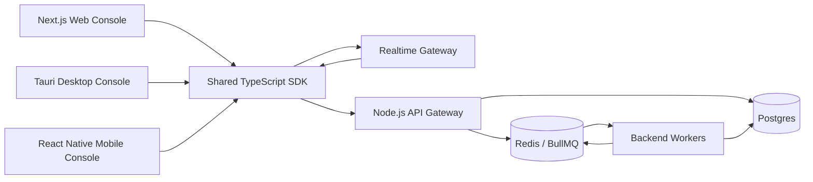

# Cross-Platform Control Platform

Sovereign Engine remains a centralized infrastructure platform. Web, desktop, and mobile clients are operational consoles only.

## Enterprise Monorepo Structure

```text
code/
├── apps/
│   ├── api-gateway/        Authoritative Next.js web control plane and API
│   ├── realtime-gateway/   WebSocket event bridge for consoles
│   ├── desktop-console/    Tauri shell for macOS, Windows, and Linux
│   └── mobile-console/     React Native shell for Android and iOS
├── libs/
│   └── platform-sdk/       Shared TypeScript SDK, auth helpers, realtime client
├── workers/                Centralized backend workers only
└── services/               Backend services only
```

## Control Boundary



Clients do not contain queue logic, sender logic, SMTP logic, or worker orchestration. They request operational actions; the API gateway verifies authorization, writes audit logs, updates durable state, and publishes realtime events.

## Realtime Architecture

- WebSocket gateway streams lane changes, reputation events, health stats, operator reconciliations, and system notices.
- REST remains authoritative for state reconciliation after every optimistic UI update.
- Clients reconnect automatically and refresh snapshots from `/api/reputation/monitor` and `/api/health/stats`.
- Backend services can publish events to the gateway through a protected `/publish` endpoint.

## Desktop Console

The Tauri shell supports:

- Live reputation monitoring.
- Provider lane controls.
- Pause/resume operations.
- Queue pressure visualization.
- Worker heartbeat map.
- Real-time event stream.
- Infrastructure diagnostics.
- Production deployment controls.
- Investor/demo recording mode.

## Mobile Console

The React Native shell supports:

- Domain health alerts.
- Emergency pause controls.
- Queue spike notifications.
- Worker outage alerts.
- Reputation degradation warnings.
- Executive KPI dashboard.
- Lightweight operational approvals.

## Operational State Synchronization

1. Console reads the latest snapshot through the SDK.
2. Console displays optimistic state for fast operator feedback.
3. Console sends a signed action request to the API gateway.
4. API verifies RBAC, device session, nonce, action signature, and tenant scope.
5. API writes tamper-evident audit records and updates Postgres/Redis state.
6. Realtime gateway broadcasts the reconciled state.
7. Console replaces optimistic state with the authoritative backend response.

## Observability Integration

Use `/api/health/stats`, `/api/system/pressure`, `/api/providers/health`, and realtime events to feed:

- Dashboard health cards.
- Desktop diagnostic panels.
- Mobile push-alert triggers.
- Datadog or ELK ingestion.
- Data-room proof captures.

## Release Automation

`.github/workflows/platform-release.yml` validates platform boundaries and defines release jobs for:

- Shared SDK validation.
- Realtime gateway checks.
- Tauri desktop packaging lanes.
- Android/iOS mobile packaging lanes.

Native signing credentials are intentionally injected only through protected GitHub Environments or the buyer's CI/CD system.
